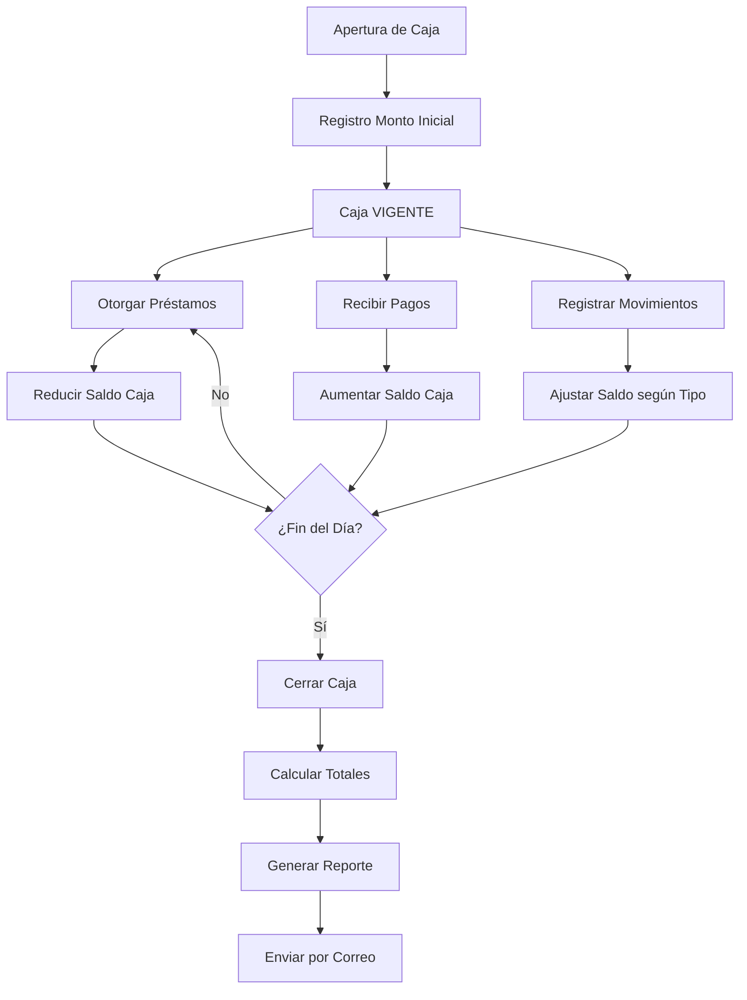

# Análisis Completo del Módulo de Caja - Sistema SIPREST

## 🏦 **Funcionalidades Actuales del Módulo**

### 1. **Gestión de Apertura y Cierre de Caja**

#### **Apertura de Caja:**
- ✅ Registro de monto inicial con descripción
- ✅ Control de fecha y hora de apertura
- ✅ Asignación automática de ID de caja
- ✅ Estado automático "VIGENTE" al aperturar

#### **Cierre de Caja:**
- ✅ Cálculo automático de:
  - Ingresos (pagos de cuotas recibidos)
  - Egresos (movimientos de salida)
  - Préstamos otorgados durante el período
  - Saldo final de caja
  - Conteo de transacciones por tipo
  - Intereses generados

### 2. **Control de Flujo de Préstamos**

#### **Validaciones Críticas:**
- ✅ **Verificación de Caja Abierta**: No se pueden otorgar préstamos sin caja vigente
- ✅ **Control de Saldo**: Validación que el monto del préstamo no exceda el saldo disponible
- ✅ **Asignación Automática**: Todo préstamo se asigna automáticamente a la caja activa

#### **Integración con Módulos:**
- 🔗 **Préstamos**: Control de disponibilidad de fondos
- 🔗 **Movimientos**: Registro de ingresos y egresos
- 🔗 **Reportes**: Generación de arqueos de caja

### 3. **Reportería y Auditoría**

#### **Reportes Disponibles:**
- ✅ Arqueo de caja detallado
- ✅ Exportación a Excel/PDF
- ✅ Envío por correo electrónico
- ✅ Visualización de movimientos por caja
- ✅ Detalle de préstamos por período de caja

## 📊 **Flujo de Trabajo Actual**



## 🎯 **Fortalezas del Sistema Actual**

### **✅ Aspectos Positivos:**

1. **Control Financiero Robusto**
   - Imposibilidad de operar sin caja abierta
   - Validación automática de fondos disponibles
   - Trazabilidad completa de movimientos

2. **Automatización Inteligente**
   - Cálculos automáticos en cierre de caja
   - Asignación automática de préstamos a caja activa
   - Actualización en tiempo real de saldos

3. **Auditoría y Reportes**
   - Reportes detallados por período
   - Exportación múltiple (Excel, PDF, Email)
   - Historial completo de operaciones

4. **Integridad de Datos**
   - Uso de stored procedures para operaciones críticas
   - Control transaccional en operaciones complejas
   - Validaciones a nivel de base de datos

## ⚠️ **Áreas de Mejora Identificadas**

### **🔴 Problemas Críticos:**

1. **Seguridad y Control de Acceso**
   ```
   PROBLEMA: No hay control de quién puede aperturar/cerrar caja
   RIESGO: Cualquier usuario puede manejar la caja
   ```

2. **Reconciliación Manual**
   ```
   PROBLEMA: No hay sistema de cuadre automático
   RIESGO: Diferencias entre sistema y efectivo real
   ```

3. **Concurrencia de Cajas**
   ```
   PROBLEMA: Solo maneja una caja activa a la vez
   LIMITACIÓN: No soporta múltiples puntos de venta
   ```

### **🟡 Mejoras Funcionales:**

1. **Dashboard de Caja en Tiempo Real**
2. **Alertas de Saldos Bajos**
3. **Integración con Bancos/Transferencias**
4. **Control de Denominaciones**
5. **Backup Automático de Datos**

## 🚀 **Sugerencias de Mejora Prioritarias**

### **📋 FASE 1: Seguridad y Control (ALTA PRIORIDAD)**

#### **1.1 Sistema de Permisos de Caja**
```sql
-- Nueva tabla de permisos
CREATE TABLE permisos_caja (
    id INT AUTO_INCREMENT PRIMARY KEY,
    usuario_id INT,
    puede_aperturar BOOLEAN DEFAULT FALSE,
    puede_cerrar BOOLEAN DEFAULT FALSE,
    puede_ver_reportes BOOLEAN DEFAULT FALSE,
    sucursal_id INT,
    fecha_asignacion DATETIME DEFAULT CURRENT_TIMESTAMP
);
```

#### **1.2 Auditoría de Acciones**
```sql
-- Tabla de log de acciones de caja
CREATE TABLE log_acciones_caja (
    id INT AUTO_INCREMENT PRIMARY KEY,
    caja_id INT,
    usuario_id INT,
    accion ENUM('apertura', 'cierre', 'consulta', 'modificacion'),
    detalles JSON,
    ip_address VARCHAR(45),
    fecha_accion DATETIME DEFAULT CURRENT_TIMESTAMP
);
```

#### **1.3 Doble Validación para Cierres**
```javascript
// Implementar confirmación doble para cierres
function confirmarCierreCaja() {
    Swal.fire({
        title: '⚠️ Confirmar Cierre de Caja',
        html: `
            <p><strong>¿Está seguro de cerrar la caja?</strong></p>
            <p>Saldo calculado: <span class="text-success">C$ ${saldoCalculado}</span></p>
            <br>
            <label>Ingrese saldo físico contado:</label>
            <input type="number" id="saldoFisico" class="form-control" step="0.01">
        `,
        showCancelButton: true,
        confirmButtonText: 'Confirmar Cierre',
        cancelButtonText: 'Cancelar',
        preConfirm: () => {
            const saldoFisico = parseFloat(document.getElementById('saldoFisico').value);
            if (!saldoFisico) {
                Swal.showValidationMessage('Debe ingresar el saldo físico');
                return false;
            }
            return { saldoFisico: saldoFisico };
        }
    });
}
```

### **📋 FASE 2: Funcionalidades Avanzadas (MEDIA PRIORIDAD)**

#### **2.1 Dashboard de Caja en Tiempo Real**
```html
<!-- Nuevo widget para dashboard -->
<div class="card bg-gradient-info">
    <div class="card-body">
        <h4 id="estado_caja_actual">Caja Cerrada</h4>
        <div class="row">
            <div class="col-6">
                <small>Saldo Inicial:</small>
                <h5 id="saldo_inicial">C$ 0.00</h5>
            </div>
            <div class="col-6">
                <small>Saldo Actual:</small>
                <h5 id="saldo_actual">C$ 0.00</h5>
            </div>
        </div>
        <div class="progress mt-2">
            <div id="progress_caja" class="progress-bar" style="width: 0%"></div>
        </div>
        <small id="texto_progreso">Sin actividad</small>
    </div>
</div>
```

#### **2.2 Alertas Inteligentes**
```javascript
// Sistema de alertas automáticas
function configurarAlertasCaja() {
    // Alerta de saldo bajo
    if (saldoActual < montoMinimoAlerta) {
        mostrarAlerta('warning', 'Saldo de caja bajo', 
            `Saldo actual: C$ ${saldoActual}. Considere reabastecer.`);
    }
    
    // Alerta de caja abierta mucho tiempo
    if (horasAbierta > 12) {
        mostrarAlerta('info', 'Caja abierta por mucho tiempo', 
            `La caja lleva ${horasAbierta} horas abierta. Considere cerrarla.`);
    }
    
    // Alerta de alta actividad
    if (transaccionesHoy > 100) {
        mostrarAlerta('success', 'Alta actividad detectada', 
            `${transaccionesHoy} transacciones realizadas hoy.`);
    }
}
```

#### **2.3 Múltiples Puntos de Caja**
```sql
-- Modificar estructura para múltiples cajas
ALTER TABLE caja ADD COLUMN punto_venta VARCHAR(50) DEFAULT 'PRINCIPAL';
ALTER TABLE caja ADD COLUMN sucursal_id INT;
ALTER TABLE caja ADD COLUMN usuario_responsable INT;

-- Permitir múltiples cajas abiertas por sucursal
-- Cambiar la lógica de "una caja activa" a "cajas activas por sucursal/punto"
```

### **📋 FASE 3: Integración y Automatización (BAJA PRIORIDAD)**

#### **3.1 Integración Bancaria**
```php
// Nueva clase para integración bancaria
class IntegracionBancaria {
    public function consultarSaldoCuentas() {
        // Integración con APIs bancarias
        // Consulta automática de saldos
    }
    
    public function registrarTransferencia($monto, $concepto) {
        // Registro automático de transferencias
        // Actualización de saldo de caja
    }
    
    public function reconciliacionAutomatica() {
        // Cuadre automático con movimientos bancarios
    }
}
```

#### **3.2 Control de Denominaciones**
```sql
-- Nueva tabla para control de billetes y monedas
CREATE TABLE control_denominaciones (
    id INT AUTO_INCREMENT PRIMARY KEY,
    caja_id INT,
    denominacion DECIMAL(10,2),
    cantidad INT,
    tipo ENUM('billete', 'moneda'),
    fecha_conteo DATETIME,
    usuario_conteo INT
);
```

## 💡 **Recomendaciones Específicas**

### **🎯 Para Implementación Inmediata:**

1. **Agregar Validación de Usuario en Caja**
   ```php
   // En caja_modelo.php
   static public function mdlValidarPermisosCaja($usuarioId, $accion) {
       $stmt = Conexion::conectar()->prepare('
           SELECT COUNT(*) as tiene_permiso 
           FROM permisos_caja 
           WHERE usuario_id = :usuario_id 
           AND puede_' . $accion . ' = 1
       ');
       $stmt->bindParam(":usuario_id", $usuarioId, PDO::PARAM_INT);
       $stmt->execute();
       return $stmt->fetch(PDO::FETCH_OBJ);
   }
   ```

2. **Mejorar Validación de Fondos**
   ```javascript
   // Validación más robusta antes de préstamos
   function validarFondosDisponibles(montoPrestamo) {
       const reservaMinima = 1000; // Monto mínimo que debe quedar en caja
       const saldoDisponible = saldoActual - reservaMinima;
       
       if (montoPrestamo > saldoDisponible) {
           Swal.fire({
               icon: 'error',
               title: 'Fondos Insuficientes',
               html: `
                   <p>Monto solicitado: <strong>C$ ${montoPrestamo}</strong></p>
                   <p>Saldo disponible: <strong>C$ ${saldoDisponible}</strong></p>
                   <p>Reserva mínima: <strong>C$ ${reservaMinima}</strong></p>
               `
           });
           return false;
       }
       return true;
   }
   ```

3. **Backup Automático de Caja**
   ```php
   // Función para backup automático al cerrar caja
   static public function mdlBackupCierreCaja($cajaId) {
       $stmt = Conexion::conectar()->prepare('
           INSERT INTO backup_cierres_caja 
           SELECT *, NOW() as fecha_backup 
           FROM caja WHERE caja_id = :caja_id
       ');
       $stmt->bindParam(":caja_id", $cajaId, PDO::PARAM_INT);
       return $stmt->execute();
   }
   ```

## 📈 **Métricas de Éxito**

### **KPIs a Implementar:**

1. **Operacionales:**
   - Tiempo promedio de apertura/cierre: < 2 minutos
   - Diferencias en cuadres: < 0.1%
   - Uptime del sistema: > 99.5%

2. **Seguridad:**
   - Accesos no autorizados: 0
   - Auditorías completas: 100%
   - Backups exitosos: 100%

3. **Eficiencia:**
   - Reducción de tiempo en cierres: 50%
   - Automatización de reportes: 80%
   - Satisfacción del usuario: > 4.5/5

## 🏁 **Conclusión**

El módulo de caja actual de SIPREST tiene una **base sólida** con funcionalidades esenciales bien implementadas. Sin embargo, para evolucionar hacia un sistema de nivel empresarial, requiere:

### **✅ Mantener:**
- Control automático de fondos
- Integración con módulo de préstamos
- Reportería básica

### **🔧 Mejorar:**
- Seguridad y permisos
- Interfaz de usuario
- Alertas y validaciones

### **➕ Agregar:**
- Múltiples puntos de caja
- Dashboard en tiempo real
- Integración bancaria

**Prioridad de implementación: FASE 1 → FASE 2 → FASE 3**

El sistema está bien diseñado para un negocio de préstamos y con estas mejoras se convertirá en una herramienta robusta y profesional. 